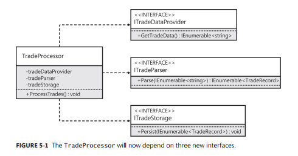
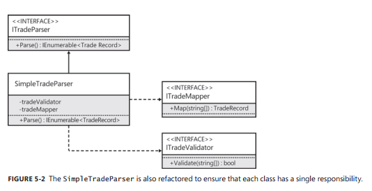
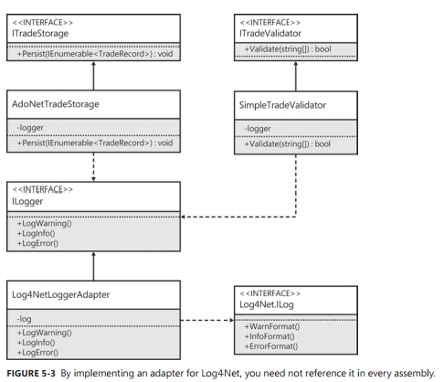
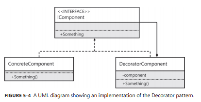
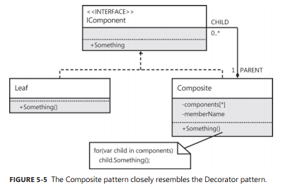
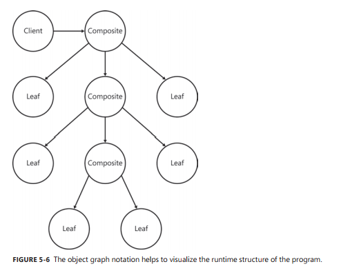
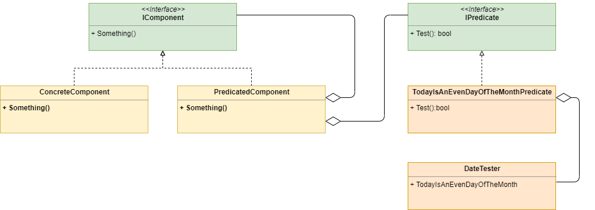
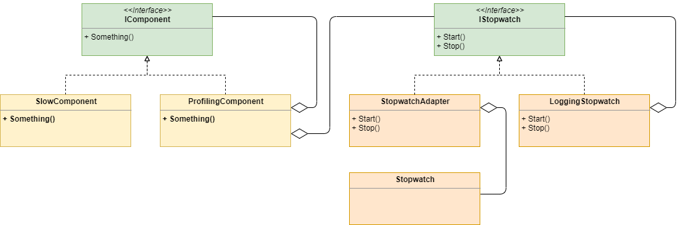

# Chapter5. 단일 책임 원칙

```
SOLID
- Single responsibility principle(단일 책임 원칙)
- Open-closed principle(개방/폐쇄 원칙)
- Liskov substitution principle(리스코프 치환 원칙)
- Interface segregation(인터페이스 분리)
- Dependency injection(의존성 주입)
```

> 단일 책임 원칙 - 오로지 한 가지 작업만 수행하며, 단 한 가지 이유에 의해서만 변경되는 코드를 작성하도록 권장하는 원칙

# 문제의 정의

[예제코드](source/Chapter5/ex5-1.cs)

TradeProcessor 클래스의 책임  
- 스트림 읽기
- 문자열 파싱하기
- 필드 유효성 검사하기
- 로깅하기
- 데이터베이스에 삽입하기
  
## 명확성을 위한 리팩토링
- ProcessTrades 메서드를 여러 개의 메서드로 분리하여 각 메서드가 한 가지 역할만을 수행하도록 만든다.
```cs
public void ProcessTrades(Stream stream)
{
    var lines = ReadTradeData(stream);
    var trades = ParseTrades(lines);
    StoreTrades(trades);
}
```
- 코드의 가독성이 향상됨

## 추상화를 위한 리팩토링
- 모든 변경사항을 수용할 수 있도록 하기 위해 추상화를 적용
- 리팩토링 첫번째 단계 - 데이터를 읽고, 처리하고, 저장하기 위한 인터페이스를 정의

  

```cs
public class TradeProcessor
{
    public TradeProcessor(ITradeDataProvider tradeDataProvider, ITradeParser tradeParser, ITradeStorage tradeStorage)
    {
        this.tradeDataProvider = tradeDataProvider;
        this.tradeParser = tradeParser;
        this.tradeStorage = tradeStorage;
    }

    public void ProcessTrades()
    {
        var lines = tradeDataProvider.GetTradeData();
        var trades = tradeParser.Parse(lines);
        tradeStorage.Persist(trades);
    }

    private readonly ITradeDataProvider tradeDataProvider;
    private readonly ITradeParser tradeParser;
    private readonly ITradeStorage tradeStorage;
}
```
변경 후 TradeProcessor Class는   
_ 어떤 형식의 거래 데이터를 다른 형식으로 전환하는 프로세스를 모델링 => 책임   
_ 다른 책임에 대해서 수정할 필요가 없어짐  
  - 데이터를 Stream이 아닌 다른 곳에서 읽고 싶을 때 (ITradeDataProvider)  
  - 로그를 콘솔이 아닌 다른 곳에서 출력하고 싶을 때 (ITradeParser)
  - 거래 데이터를 다른 곳에 저장하고 싶을 때 (ITradeStorage)

### TradeDataProvider

```cs
public class StreamTradeDataProvider : ITradeDataProvider
{
    public StreamTradeDataProvider(Stream stream)
    {
        this.stream = stream;
    }

    public IEnumerable<string> GetTradeData()
    {
        var tradeData = new List<string>();
        using (var reader = new StreamReader(stream))
        {
            string line;
            while ((line = reader.ReadLine()) != null)
            {
                tradeData.Add(line);
            }
        }
        return tradeData;
    }   

    private Stream stream;
}
```
- 데이터를 다른 곳에서 읽어오고 싶을 때만 변경
- `ITradeDataProvider`는 Stream 클래스에 의존하지 않음
- 인터페이스를 정의하고 추상화를 적용하는 방향으로 리팩토링할 때는 코드의 적응성에 영향을 미치는 의존성을 남겨두지 않는 것이 중요하다.
- Stream이 아닌 다른 곳에서 데이터를 읽어 올 수 있다.
- `TradeProcessor`는 오로지 `ITradeDataProvider`를 통해서 `GetTradeData` 메서드의 시그니처에 대해서만 알 수 있다.

### TradeParser

  


- 유효성 검사와 매핑 기능을 하는 책임도 별개의 클래스로 분리하여 하나의 책임만 하도록 수정
- SimpleTradeParser - 거래 데이터의 형식이 변경되는 경우에만 수정

```cs
public class SimpleTradeParser : ITradeParser
{
    private readonly ITradeValidator tradeValidator;
    private readonly ITradeMapper tradeMapper;

    public SimpleTradeParser(ITradeValidator tradeValidator, ITradeMapper tradeMapper)
    {
        this.tradeValidator = tradeValidator;
        this.tradeMapper = tradeMapper;
    }

    public IEnumerable<TradeRecord> Parse(IEnumerable<string> tradeData)
    {
        var trades = new List<TradeRecord>();
        var lineCount = 1;
        foreach (var line in tradeData)
        {
            var fields = line.Split(new char[] { ',' });

            if (!tradeValidator.Validate(fields))
            {
                continue;
            }

            var trade = tradeMapper.Map(fields);

            trades.Add(trade);

            lineCount++;
        }

        return trades;
    }
}
```

### TradeStorage

- 로깅 기능을 추상화!! 

  

> 구현 코드  
[AdoNetTradeStorage](source/Chapter5/AdoNetTradeStorage.cs)  
[SimpleTradeValidator](source/Chapter5/SimpleTradeValidator.cs)

- `Log4NetLoggerAdapter`   
  - 어댑터 클래스로 만들어서 third-party를 first-party 참조로 변경
- `ILogger`
  - AdoNetTradeStorage, SimpleTradeValidator가 참조
  - 런타임에는 Log4Net 라이브러리 의존
  - Log4Net 라이브러리에 대한 참조는 애플리캐이션 진입점과 새로 생성하는 Service.Log4Net


# SRP와 데코레이터 패턴

> **데코레이터 패턴** - 개별 클래스가 단일 책임을 가질 수 있도록 하기에 매우 적합한 패턴

  

## 컴포지트 패턴
> **컴포지트 패턴** - 데코레이터 패턴에서 파생한 패턴으로서 데코레이터 패턴을 사용하는 일반적인 패턴 중 하나

  

**목적**
- 여러 인터페이스의 인스턴스를 마치 하나의 인스턴스인 것처럼 취급하는 것이다.
- 그래서 클라이언트는 단 하나의 인스턴스만을 받아들인 후 별도의 수정 없이도 해당 인스턴스를 여러 개의 인스턴스처럼 활용할 수 있는 방법이다.

- 이 패턴을 이용하면 하나 그 이상의 CompositeComponent객체를 AddComponent 메서드에 전달하여 상속 구조를 표현하는 트리 형태의 인스턴스를 조합하여 연결할 수 있다.

  

## 조건부 데코레이터(Predicate Decorator)
> **조건부 데코레이터** - 코드가 조건부로 실행되는 과정을 클라이언트에게 숨기고자하는 경우에 유용

  

- `TodayIsAnEvenDayOfTheMonthPredicate` - 어댑터 패턴

## 분기 데코레이터(Branching Decorator)
> 조건부 데코레이터에 약간의 수정을 가하면 데코레이트된 인터페이스를 받아들여 조건식의 결과가 거짓인 경욷에도 뭔가를 실행할 수 있도록 변경할 수 있다.

```cs
public class BranchedComponent : IComponent
{
    public BranchedComponent(
        IComponent trueComponent, 
        IComponent falseComponent,           
        IPredicate predicate)
    {
        this.trueComponent = trueComponent;
        this.falseComponent = falseComponent;
        this.predicate = predicate;
    }

    public void Something()
    {
        if (predicate.Test())
        {
            trueComponent.Something();
        }
        else
        {
            falseComponent.Something();
        }
    }

    private readonly IComponent trueComponent;
    private readonly IComponent falseComponent;
    private readonly IPredicate predicate;
}
```

## 지연 데코레이터(Lazy Decorator)
> 지연 데코레이터 - 클라이언트가 실제로 해당 인스턴스를 사용하기 전까지는 객체의 인스턴스를 생성하지 않는 기능을 제공하기 위한 것

```cs
// 클라이언트는 객체가 지연 생성될 것임을 인지할 수 밖에 없다.
public class ComponentClient
{
    public ComponentClient(Lazy<IComponent> component)
    {
        this.component = component;
    }

    public void Run()
    {
        component.Value.Something();
    }

    private readonly Lazy<IComponent> component;
}
```

```cs
public class LazyComponent : IComponent
{
    public LazyComponent(Lazy<IComponent> lazyComponent)
    {
        this.lazyComponent = lazyComponent;
    }

    public void Something()
    {
        lazyComponent.Value.Something();
    }
    
    private readonly Lazy<IComponent> lazyComponent;
}

// 인터페이스를 활용
// 클라이언트는 객체가 지연생성될 거라 인지하지 못 함
public class ComponentClient
{
    public ComponentClient(IComponent component)
    {
      this.component = component;
    }
    
    public void Run()
    {
        component.Something();
    }
    
    private readonly IComponent component;
}
```

## 로깅 데코레이터(Logging decorator)

```cs
public class LoggingCalculator : ICalculator
{
    public LoggingCalculator(ICalculator calculator)
    {
        this.calculator = calculator;
    }

    public int Add(int x, int y)
    {
        Console.WriteLine("Add(x={0}, y={1})", x, y);
        var result = calculator.Add(x, y);
        Console.WriteLine("result={0}", result);
        return result;
    }

    private readonly ICalculator calculator;
}

// . . .
public class ConcreteCalculator : ICalculator
{
    public int Add(int x, int y)
    {
        return x + y;
    }
}
```
제약사항
- 데코레이터에 의해 감싸진 클래스(`ConcreteCalculator`)의 private 멤버에 대한 로그를 기록할 수 없다.
- 애플리케이션에서 정의한 모든 인터페이스에 대해 로깅 데코레이터를 구현해야한다.

> 일반적으로 로깅은 관점지향프로그래밍(AOP)으로 구현 한다.

## 프로파일링 데코레이터(Profiling decorator)

> 닷넷 프레임워크를 사용하는 애플리케이션의 병목을 확인하기 위해 사용

  


## 비동기 데코레이터(Asynchronous decorator)

[예제코드 5-31](source/Chapter5/ex5-31.cs)  
- 명령을 UI 스레드 내에서 실행하면 명령을 실행하는 동안 스레드가 블록되어 UI가 응답하지 못하는 상태가 된다.


`예제코드 5-32` - Dispatcher 클래스를 사용하는 WPF용 비동기 데코레이터
```cs
public class AsyncComponent : IComponent
{
    public AsyncComponent(IComponent decoratedComponent)
    {
        this.decoratedComponent = decoratedComponent;
    }
    
    public void Process()
    {
        Task.Run((Action)decoratedComponent.Process);
    }

    private readonly IComponent decoratedComponent;
}
```
- Task를 사용하여 별도의 스레드에서 실행된다.
- Task클래스의 의존성을 갖게 된다.
- 하지만, Task 클래스에 의존적이기 때문에 테스트하기 어렵다.

### 비동기 데코레이터의 한계

## 속성과 이벤트 데코레이트하기

```cs
// 메서드와 마찬가지로 속성에도 데코레이터 패턴을 적용할 수 있다.
public class ComponentDecorator : IComponent
{
    public ComponentDecorator(IComponent decoratedComponent)
    {
        this.decoratedComponent = decoratedComponent;
    }
    public string Property
    {
        get
        {
            // We can do some mutation here after retrieving the value
            return decoratedComponent.Property;
        }
        set
        {
            // And/or here, before we set the value
            decoratedComponent.Property = value;
        }
    }
    private readonly IComponent decoratedComponent;
}
```

```cs
// 이벤트 역시 데코레이터 패턴을 적용할 수 있다.
public class ComponentDecorator : IComponent
{
    public ComponentDecorator(IComponent decoratedComponent)
    {
        this.decoratedComponent = decoratedComponent;
    }
    public event EventHandler Event
    {
        add
        {
            // We can do something here, when the event handler is registered
            decoratedComponent.Event += value;
        }
        remove
        {
            // And/or here, when the event handler is deregistered
            decoratedComponent.Event -= value;
        }
    }
    private readonly IComponent decoratedComponent;
}
```

## switch 구문 대신 전략 패턴 사용하기

[OnlineCart_Switch](source/Chapter5/ex5-35.cs)  


- Switch 구문을 사용하는 곳이라면 전략 패턴(Strategy Pattern)을 적용하여 클리아언트가 의존 인터페이스의 복잡도를 다른 곳으로 위임하도록 할 수 있다.
- 문제점 
  - 새로운 선택 사항을 추가하게 되면 클래스의 코드를 변경해야 한다.

[OnlineCart_Strategy](source/Chapter5/ex5-36.cs)

- 결제 방식을 IPaymentStrategy 인테페이스를 구현하는 각기 다른 클래스로 객체화한 것
- PaymentType(enum)값과 IPaymentStrategy의 인스턴스를 매핑하기 위한 컬랙션을 가지고 있어, CheckOut 메소드의 구현이 간편해졌음
- 서로 다른 결제 수단을 어떻게 처리해야 하는지에 대해 알아야 할 필요가 없어졌다.
- 결제 수단의 종류에 따라 서로 다른 처리 과정을 알 필요도 없어졌으며, 불필요한 의존성을 내포할 필요도 없어졌다.
- 이 클래스(OnlineCart)의 역할은 오로지 올바른 결제 전략을 선택하여 처리를 맡기는 것이다.
- 하지만, 새로운 결제 수단을 추가하려면 생성자를 수정해야 한다.

## 마치며
- 단일 책임 원칙은 코드의 적응성에 매우 긍적적인 영향을 끼친다.
- SRP를 준수하면 클래스 개수는 증가하지만 작은 범위를 보다 명료하게 처리할 수 있다.
- 어댑터 패턴과 데코레이터 패턴을 사용하면 SRP 준수에 도움이 된다.
- `어댑터 패턴`을 적용하면 서드파티 의존적인 코드를 퍼스트파티 인터페이스로 추상화되어, 다른 코드들이 이 인터페이스를 참조하도록 구현할 수 있어 코드 관리가 수월해진다.
- `데코레이터 패턴`은 클래스의 기능을 다른 클래스로 분리해야 하지만, 해당 기능이 클래스의 의도와 너무 강력하게 관련되어 있는 경우 유용하다.