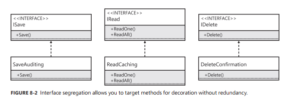
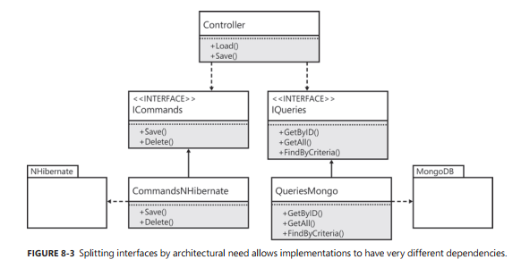

# Chapter8. 인터페이스 분리(Interface Segregation Principle, ISP)

**Chapter at a Glance**
```
- 인터페이스 분리의 중요성을 이해한다.
- 클라이언트의 요구 사항을 최우선으로 고려한 인터페이스를 작성한다
- 직관적인 목적을 갖는, 보다 작은 크기의 인터페이스를 정의한다.
- 인터페이스 분리 개념을 적용할 수 있는 시나리오를 구분한다.
- 구현 코드의 의존성에 따라 인터페이스를 분리한다. 
```

> 인터페이스 분리(interface segregation) 원칙 - 인터페이스를 **최대한 간소**하게 유지하기 위한 원칙  

```
"Clients should not be forced to depend upon interfaces that they do not use." 
 - by Robert C. Martin
```

# 인터페이스 분리 예제


## 간단한 CRUD 인터페이스

```cs
// CRUD 작업을 통해 엔티티를 영구 저장소에 저장할 수 있도록 지원하는 인터페이스
public interface ICreateReadUpdateDelete<TEntity>
{
    // 생성(C)
    void Create(TEntity entity);
    
    // 읽기(R)
    TEntity ReadOne(Guid identity);
    IEnumerable<TEntity> ReadAll();
    
    // 쓰기(U)
    void Update(TEntity entity);
    
    // 삭제(D)
    void Delete(TEntity entity);
}
```

#### 예시
```
- 어떤 데코레이터는 한 인터페이스에 정의된 전체 메서드가 아닌, 일부에만 적용할 수 있다.  
- 예, 삭제하기 전에 클라이언트에게 먼저 확인하려고 할 때
```
- 이미 존재하는 클래스를 수정하면 안된다. (개방/폐쇄원칙 위반)
- 삭제 동작을 수행하기 위해 사용하는 인터페이스에 대한 새로운 구현체를 구현해야 함


```cs
public class DeleteConfirmation<TEntity> : ICrud<TEntity>
{
    private readonly ICreateReadUpdateDelete<TEntity> decoratedCrud;

    public DeleteConfirmation(ICreateReadUpdateDelete<TEntity> decoratedCrud)
    {
        this.decoratedCrud = decoratedCrud;
    }

    public void Create(TEntity entity)
    {
        decoratedCrud.Create(entity);
    }

    public TEntity ReadOne(Guid identity)
    {
        return decoratedCrud.ReadOne(identity);
    }

    public IEnumerable<TEntity> ReadAll()
    {
        return decoratedCrud.ReadAll();
    }

    public void Update(TEntity entity)
    {
        decoratedCrud.Update(entity);
    }

    public void Delete(TEntity entity)
    {
        Console.WriteLine("Are you sure you want to delete the entity? [Y/N]");
        var keyInfo = Console.ReadKey();
        if (keyInfo.Key == ConsoleKey.Y)
        {
            decoratedCrud.Delete(entity);
        }
    }
}
```
- Delete 메서드를 제외한 나머지 메서드는 자신이 감싸고 있는 인터페이스로 흘려보낸다(pass-through). 즉, 데코레이션을 수행하지 않는다.
- (단점) 단위 커버리지를 유지하기 위해 모든 메서드에 대한 테스트 코드를 작성해야 한다.


#### 분리

```cs
public interface ICreateReadUpdate<TEntity>
{
    void Create(TEntity entity);
    TEntity ReadOne(Guid identity);
    IEnumerable<TEntity> ReadAll();
    void Update(TEntity entity);
}

// . . .
public interface IDelete<TEntity>
{
    void Delete(TEntity entity);
}
```

```cs
public class DeleteConfirmation<TEntity> : IDelete<TEntity>
{
    private readonly IDelete<TEntity> decoratedDelete;

    public DeleteConfirmation(IDelete<TEntity> decoratedDelete)
    {
        this.decoratedDelete = decoratedDelete;
    }

    public void Delete(TEntity entity)
    {
        Console.WriteLine("Are you sure you want to delete the entity? [y/N]");
        var keyInfo = Console.ReadKey();
        if (keyInfo.Key == ConsoleKey.Y)
        {
            decoratedDelete.Delete(entity);
        }
    }
}
```
장점
- 코드가 잛아졌고 의도가 명확해졌다.
- 테스트 코드도 잛아지게 됐다.

리팩토링 관점
- 고객에게 보여줄 질문은 인터페이스로 캡슐화해야한다.
- `DeleteConfirmation`클래스는 단일 책임 원칙을 준수하지 않기 때문에 반드시 분리해야한다.
- 변경이 필요한 이유 
  - 구현하고 있는 인터페이스가 변경되었기 때문
  - 사용자에게 각기 다른 방법으로 확인을 받아내야 하기 때문


```cs
// 사용자에게 확인을 요구하는 매우 간단한 인터페이스
public interface IUserInteraction
{
    bool Confirm(string message);
}

public class DeleteConfirmation<TEntity> : IDelete<TEntity>
{
    private readonly IDelete<TEntity> decoratedDelete;
    private readonly IUserInteraction userInteraction;

    public DeleteConfirmation(IDelete<TEntity> decoratedDelete, IUserInteraction userInteraction)
    {
        this.decoratedDelete = decoratedDelete;
        this.userInteraction = userInteraction;
    }

    public void Delete(TEntity entity)
    {
        if (userInteraction.Confirm("Are you sure you want to delete the entity?"))
        {
            decoratedDelete.Delete(entity);
        }
    }
}
```

## 캐싱
- 읽기 메서드인 `ReadOne`과 `ReadAll` 메서드 데코레이터를 구현
- `Create`와 `Update`는 캐싱할 이유가 없다.

```cs
// 여전히 메서드 호출을 흘려보내는 메서드들을 구현하고 있는 캐싱 데코레이터
public class CrudCaching<TEntity> : ICreateReadUpdate<TEntity>
{
    private TEntity cachedEntity;
    private IEnumerable<TEntity> allCachedEntities;
    private readonly ICreateReadUpdate<TEntity> decorated;

    public CrudCaching(ICreateReadUpdate<TEntity> decorated)
    {
        this.decorated = decorated;
    }
    
    public void Create(TEntity entity)
    {
        decorated.Create(entity);
    }
    
    public TEntity ReadOne(Guid identity)
    {
        if(cachedEntity == null)
        {
            cachedEntity = decorated.ReadOne(identity);
        }
        return cachedEntity;
    }
    
    public IEnumerable<TEntity> ReadAll()
    {
        if (allCachedEntities == null)
        {
            allCachedEntities = decorated.ReadAll();
        }
        return allCachedEntities;
    }
    
    public void Update(TEntity entity)
    {
        decorated.Update(entity);
    }
}
```
- 여전히 불필요한 메서드(`Create`, `Update`)를 구현하고 있다.
  
#### 인터페이스 분리
- 데이터를 읽는 두 메서드(`ReadOne`, `ReadAll`)를 별개의 인터페이스로 분리하게 됨
- 따라서, 이 인터페이스만을 따로 데코레이션할 수 있게 됨

```cs

// IRead 인터페이스는 ReadCaching 데코레이터를 지원한다

public interface IRead<TEntity>
{
    TEntity ReadOne(Guid identity);
    IEnumerable<TEntity> ReadAll();
}

// . . .
public class ReadCaching<TEntity> : IRead<TEntity>
{
    private TEntity cachedEntity;
    private IEnumerable<TEntity> allCachedEntities;
    private readonly IRead<TEntity> decorated;
    
    public ReadCaching(IRead<TEntity> decorated)
    {
        this.decorated = decorated;
    }
    
    public TEntity ReadOne(Guid identity)
    {
        if(cachedEntity == null)
        {
            cachedEntity = decorated.ReadOne(identity);
        }
        return cachedEntity;
    }
    
    public IEnumerable<TEntity> ReadAll()
    {
        if (allCachedEntities == null)
        {
            allCachedEntities = decorated.ReadAll();
        }
        return allCachedEntities;
    }
}
```

### 마지막 데코레이터
```cs
public interface ICreateUpdate<TEntity>
{
    void Create(TEntity entity);
    void Update(TEntity entity);
}
```

- `Create`와 `Update` 메서드의 시그니처도 동일하고, 목적 자체(데이터 기록)도 유사하다
- 클라이언트는 생성과 수정을 구분할 필요가 없다
- 하나로 합쳐보자 (`Save`)

```cs
public interface ISave<TEntity>
{
    void Save(TEntity entity);
}
```

#### 변경 사항을 추적하는 데코레이터

```cs
// 변경 추적 데코레이터는 두 개의 ISave 인터페이스 인스턴스를 활용한다.
public class SaveAuditing<TEntity> : ISave<TEntity>
{
    private readonly ISave<TEntity> decorated;
    private readonly ISave<AuditInfo> auditSave;
    
    public SaveAuditing(ISave<TEntity> decorated, ISave<AuditInfo> auditSave)
    {
        this.decorated = decorated;
        this.auditSave = auditSave;
    }
    
    public void Save(TEntity entity)
    {
        decorated.Save(entity);
        var auditInfo = new AuditInfo
        {
            UserName = Thread.CurrentPrincipal.Identity.Name,
            TimeStamp = DateTime.Now
        };
        auditSave.Save(auditInfo);
    }
}
```
- `ISave` 인터페이스를 구현하면서, 두 개의 `ISave` 인터페이스 구현체를 필요로 한다
- 첫 번째 `ISave` 구현체
  - TEntity 제네릭 타입 매개변수와 일치하는 데코레이터
  - 해당 엔티티를 실제로 저장하는 작업
- 두 번째 `ISave` 구현체
  - AuditInfo 타입을 저장하는 구현체

- 클라이언트 
  - 데코레이터가 어떤 동작을 수행하는지 전혀 알 필요가 없도록 구현
  - 변경 사항을 추적하고 있다는 것 자체를 인지할 수 없어야 한다.
  - 이 기능을 구현함으로써 클라이언트에는 어떤 변경도 발생해서는 안 된다.
- `ISave<TEntity>`의 최종 구현체 (실제 저장 작업을 수행)
  - 데코레이터에 대해 인지할 필요 없음
  - 데코레이션을 위해 변경이 되면 안 됨

인터페이스 분리 작업을 통해 새롭게 정의된 인터페이스와 데코레어터
  


## 다중 인터페이스 데코레이션
- 지금까지 구현했던 각 데코레이터는 자신이 확장하고자 하는 인터페이스와 일대일 관계
- 데코레이터 패턴을 어댑터 패턴과 함께 사용하면 코드의 작성을 최소화하면서 다중 데코레이터를 구현할 수 있다.


#### 이벤트를 발행-구독하는 데코레이터

```cs

// 이벤트 발행
public interface IEventPublisher
{
    void Publish<TEvent>(TEvent @event) where TEvent : IEvent;
}

// 이벤트 구독
public interface IEventSubscriber
{
    void Subscribe<TEvent>(TEvent @event) where TEvent : IEvent;
}
```

```cs
// 엔티티가 삭제됐을 때 이벤트를 발행하는 데코레이터
public class DeleteEventPublishing<TEntity> : IDelete<TEntity>
{
    private readonly IDelete<TEntity> decorated;
    private readonly IEventPublisher eventPublisher;
    
    public DeleteEventPublishing(IDelete<TEntity> decorated, IEventPublisher eventPublisher)
    {
        this.decorated = decorated;
        this.eventPublisher = eventPublisher;
    }
    
    public void Delete(TEntity entity)
    {
        decorated.Delete(entity);
        var entityDeleted = new EntityDeletedEvent<TEntity>(entity);
        eventPublisher.Publish(entityDeleted);
    }
}
```

```cs
// 하나의 클래스에 두 개의 데코레이터를 구현한 코드
public class ModificationEventPublishing<TEntity> : IDelete<TEntity>, ISave<TEntity>
{
    private readonly IDelete<TEntity> decoratedDelete;
    private readonly ISave<TEntity> decoratedSave;
    private readonly IEventPublisher eventPublisher;
    
    public ModificationEventPublishing(
        IDelete<TEntity> decoratedDelete, 
        ISave<TEntity> decoratedSave, 
        IEventPublisher eventPublisher)
    {
        this.decoratedDelete = decoratedDelete;
        this.decoratedSave = decoratedSave;
        this.eventPublisher = eventPublisher;
    }
    
    public void Delete(TEntity entity)
    {
        decoratedDelete.Delete(entity);
        var entityDeleted = new EntityDeletedEvent<TEntity>(entity);
        eventPublisher.Publish(entityDeleted);
    }
    
    public void Save(TEntity entity)
    {
        decoratedSave.Save(entity);
        var entitySaved = new EntitySavedEvent<TEntity>(entity);
        eventPublisher.Publish(entitySaved);
    }
}
```
- 하나의 클래스는 여러 개의 데코레이터를 구현할 수 있다.
- 다만, 위 예제처럼 문맥을 공유할 수 있는 경우에만 
  - `ModificationEventPublishing` 데코레이터는 두 개의 인터페이스에 대해 동일한 기능(이벤트를 발행)을 구현하고 있다.

#### 주의
- 의존성이 있는 다른 데코레이터와 동일한 클래스에 구현하면 안된다.
  - 각자 의존성을 가지고 있는 객체와 함께 별개의 어셈블리로 분리하여 구현하는 것이 바람직

# 클라이언트 생성

- 인터페이스의 디자인(인터페이스를 분리하거나 혹은 다른 패턴을 적용하는 것)은 인터페이스를 구현하는 클래스 및 인터페이스를 사용하는 클라이언트에 영향을 미친다.  
- 이번 장에서
  - 구현체를 직접 구현하고, 이를 클라이언트의 생성자 매개변수를 통해 전달하는 방법을 설명
    
- 클라이언트에 구현체를 전달하는 방법

## 다중 구현과 다중 인스턴스
- 분리된 인터페이스를 각기 다른 클래스에 구현하는 방법

```cs
public class OrderController
{
    private readonly IRead<Order> reader;
    private readonly ISave<Order> saver;
    private readonly IDelete<Order> deleter;

    public OrderController(IRead<Order> orderReader, ISave<Order> orderSaver, IDelete<Order> orderDeleter)
    {
        reader = orderReader;
        saver = orderSaver;
        deleter = orderDeleter;
    }

    public void CreateOrder(Order order)
    {
        saver.Save(order);
    }

    public Order GetSingleOrder(Guid identity)
    {
        return reader.ReadOne(identity);
    }

    public void UpdateOrder(Order order)
    {
        saver.Save(order);
    }
    
    public void DeleteOrder(Order order)
    {
        deleter.Delete(order);
    }
}
```

```cs
static OrderController CreateSeparateServices()
{
    var reader = new Reader<Order>();
    var saver = new Saver<Order>();
    var deleter = new Deleter<Order>();

    return new OrderController(reader, saver, deleter);
}
```
- 세 매개변수는 서로 다른 인스턴스일 뿐 아니라, 서로 다른 type이기도 하다

## 단일 구현과 단일 인스턴스
- (분리된) 모든 인터페이스를 하나의 클래스에 구현하는 방법

```cs
public class CreateReadUpdateDelete<TEntity> : IRead<TEntity>, ISave<TEntity>, IDelete<TEntity>
{
    // ...
}
```
- 클라이언트는 이 클래스의 존재를 알지 못한다
- 클라이언트 시각에서는 각 인터페이스는 인터페이스에 정의된 멤버만 가지고 있는 것처럼 보인다. (`정보의 보호 및 캡슐화`)

```cs
public OrderController CreateSingleService()
{
    var crud = new CreateReadUpdateDelete<Order>();
    return new OrderController(crud, crud, crud);
}
```
- `CreateReadUpdateDelete` 클래스는 세 개의 인터페이스를 구현하고 있기 때문에 컨트롤로의 **세 매개변수에 모두 전달이 가능**
- 인터페이스 분리 원칙을 준수함에 따라 발생할 수 있는 일반적인 부작용

분리된 인터페이스별로 데코레이터나 어댑터를 모두 구현하는 경우도 있지만, 대부분은 **적절한 인터페이스만을 기준으로 데코레이터나 어댑터를 구현**하는 것이 보다 일반적이다.


## 인터페이스 수프 안티패턴
- 하나의 인스턴스를 여러 번 전달하는 상황을 없애기 위해 주로 사용
  
```cs
// 분리한 인터페이스들을 다시 섞어 버리는 것은 인터페이스 분리를 올바르게 활요하는 방법이 아니다
interface IInterfaceSoupAntiPattern<TEntity> : IRead<TEntity>, ISave<TEntity>, IDelete<TEntity>
{
}
```
- 인터페이스를 섞은 `인터페이스 soup`를 만들어 버리면 인터페이스 분리의 장점이 희석
- 구현체들이 또 다시 모든 작업을 구현해야 하기 때문에 특정 작업만을 데코레이션 하지 못한다.

# 인터페이스를 분리하는 이유
- 인터페이스를 데코레이션하는 능력(혹은 사항)이 필요한 경우뿐
- 그 외, 클라이언트 요구와 아키텍처 디자인에 기반을 둔 이유가 있음

## 클라이언트의 요구
- 필요한 기능을 모두 정의한 인터페이스는 클라이언트에게 너무 많은 것을 제공하는 경향이 있다.
  - 클라이언트는 사용하지 말아야 할 일을 할 수 있다.
  - 클라이언트는 의도와 다르게 사용할 수 있다.
- 모든 클래스는 하나의 책임만 수행해야 한다.

### 사용자 테마 설정 예시

```cs
// 애플리케이션의 현재 테마를 설정하기 위한 인터페이스
public interface IUserSettings
{
    string Theme { get; set; }
}
```
- 읽기/쓰기가 분리되어 있지 않아, 클라이언트가 잘못 사용할 수 있다.

```cs
// 테마를 읽는 부분과 쓰는 부분을 분리한 인터페이스
public interface IUserSettingsReader
{
    string Theme { get; }
}

public interface IUserSettingWriter
{
    string Theme { set; }
}
```
- 인터페이스를 분리하였다. 
  - 사용자 설절을 읽는 인터페이스(`IUserSettingsReader`를 통해서는 쓰기 기능에 접근할 수 없다.
- 개발자들이 실수로 인해 해서는 안 될 작업을 수행함으로써 컨트롤러의 목적을 혼란스럽게 할 수 있는 가능성이 사라졌다.

```cs

public interface IUserSettingsReader
{
    string GetTheme();
}

// 읽기용 인터페이스를 상속하여 정의한 쓰기용 인터페이스
public interface IUserSettingsWriter : IUserSettingsReader
{
    void SetTheme(string theme);
}

```

### 권한 확인

- 로그인 여부에 따라 달라지는 애플리케이션에서 수행할 수 있는 동작

```cs
public interface IUnauthorized
{
    IAuthorized Login(string username, string password);
    void RequestPasswordReminder(string emailAddress);
}


public interface IAuthorized
{
    void ChangePassword(string oldPassword, string newPassword);
    void AddToBasket(Guid itemID);
    void Checkout();
    void Logout();
}
```

#### 클라이언트 요구에 따라 인터페이스를 분리
- 프로그래머들이 허용되지 않는 동작을 수행하는 것을 사전에 방지
  - 프로그래머들이 인증되지 않은 사용자를 이용하여 인증이 필요한 동작을 수행하는 것을 막을 수 있다.
  


## 아키텍처의 요구
- 인터페이스 분리 원칙의 적용을 촉진하는 두 번째 요소는 `아키텍처 디자인`이다.
- 상위 레벨 코드에서의 의사결정은 경우에 따라 하위 레벨의 코드에 엄청난 영향을 끼친다.

#### 예시 - 비대칭 아키텍처를 적용하기로 결정한 상황
```cs
// 이 영속 계층 인터페이스는 명령과 질의를 모두 수행한다.
public interface IPersistence
{
    IEnumerable<Item> GetAll();
    Item GetByID(Guid identity);
    IEnumerable<Item> FindByCriteria(string criteria);
    void Save(Item item);
    void Delete(Item item);
}
```
- 이 인터페이스를 사용할 비대칭 아키텍처는 CQRS(Command Query Responsibility Segregation) 패턴이다.

```cs
// 명령과 질의가 비대칭적으로 이루어지면 구현이 복잡해진다.
public class Persistence : IPersistence
{
    private readonly ISession session;
    private readonly MongoDatabase mongo;
    
    public Persistence(ISession session, MongoDatabase mongo)
    {
        this.session = session;
        this.mongo = mongo;
    }
    
    public IEnumerable<Item> GetAll()
    {
        return mongo.GetCollection<Item>("items").FindAll();
    }
    
    public Item GetByID(Guid identity)
    {
       return mongo.GetCollection<Item>("items").FindOneById(identity.ToBson());
    }
 
    public IEnumerable<Item> FindByCriteria(string criteria)
    {
        var query = BsonSerializer.Deserialize<QueryDocument>(criteria);
        return mongo.GetCollection<Item>("Items").Find(query);
    }
 
    public void Save(Item item)
    {
        using(var transaction = session.BeginTransaction())
        {
            session.Save(item);
            transaction.Commit();
        }
    }
 
    public void Delete(Item item)
    {
        using(var transaction = session.BeginTransaction())
        {
            session.Delete(item);
            transaction.Commit();
        }
    }
}
```
- 두 가지 의존성
  - 명령의 실행 - NHibernate 프레임워크
  - 질의 - MongoDB
  - 이 두 가지에 의해 변경이 발생할 수 있다.
- 질의와 명령 두 가지 기준으로 분리

아키텍처의 필요에 의해 분리된 인터페이스는 완전히 다른 의존성을 갖게 된다.  
 

- 이 두 구현체는 서로 다른 클래스일 뿐아니라 서로 다른 패키지(어셈블리)에 구현되어야 한다.


## 단일 메서드 인터페이스
- 인터페이스를 분리하다 보면 결국에는 인터페이스의 크기가 매우 작아진다.
- 작아지면, 활용도는 높아진다.

```cs
// 가장 간단한 인터페이스
public interface ITask
{
    void Do();
}
```

```cs
// 문맥 매개변수가 추가된 IAction 인터페이스
public interface IAction<TContext>
{
    void Do(TContext context);
}
```
```cs
// 리턴 값을 정의하는 IFunction 인터페이스
public interface IFunction<TReturn>
{
    TReturn Do();
}
```

```cs
// bool값을 리턴하는 함수를 정의한 IPredicate 인터페이스
public interface IPredicate
{
    bool Test();
}
```


# 마치며
인터페이스를 분리하는 이유
- 데코레이션을 지원하기 위해
- 클라이언트로부터 기능을 올바르게 숨기기 위해
- 다른 개발자를 위하여 스스로 문서화된 코드를 작성하기 위해
- 아키텍처 디자인의 영향을 받아서 분리되는 경우

`처음부터 올바른 방향으로 코드를 작성하는 것이 바람직`
